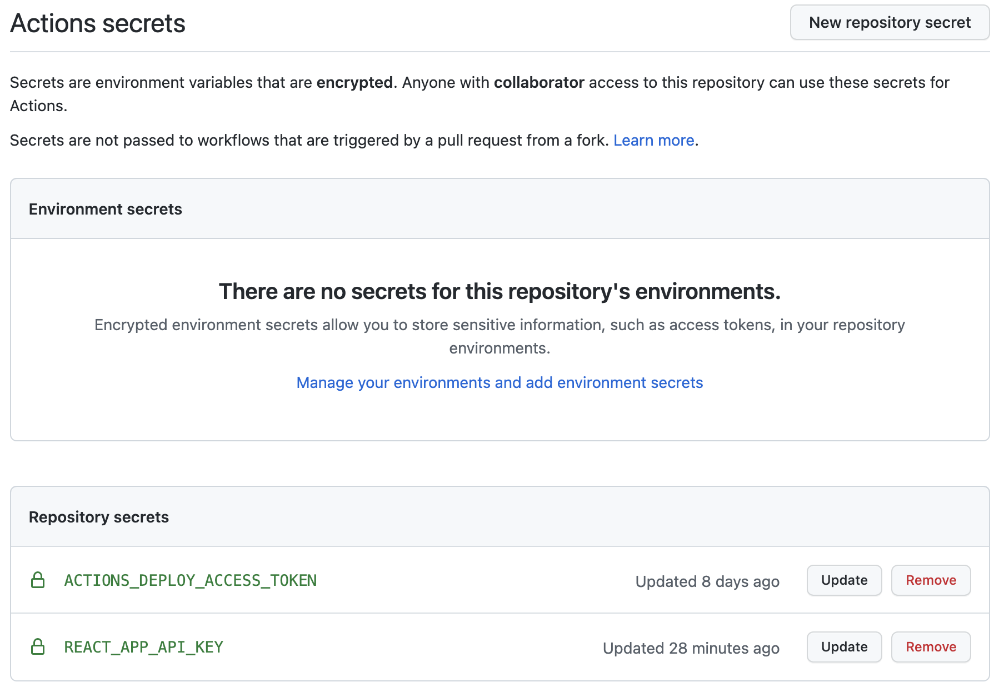
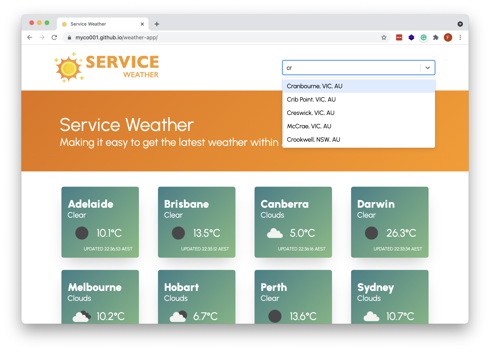
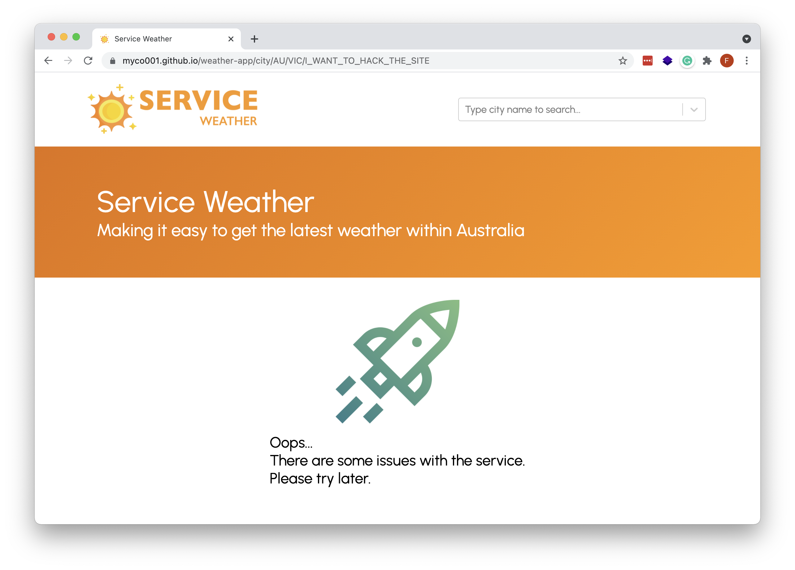
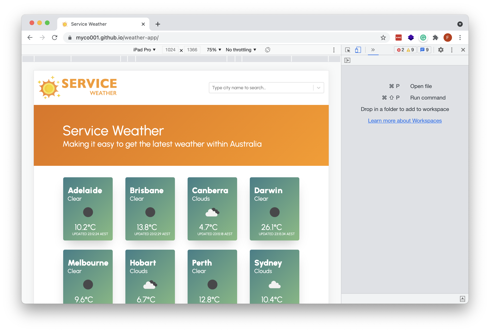
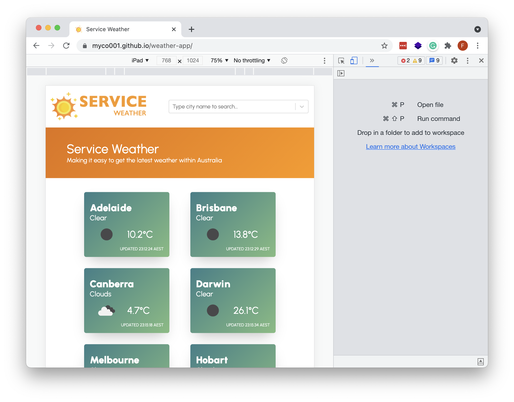
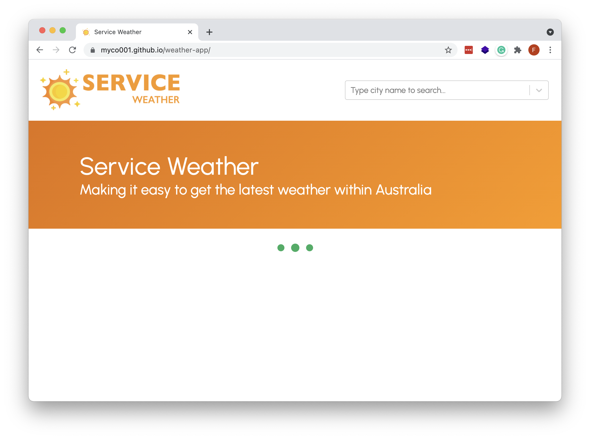

# 1. Build and Run the Code

**_Service Weather_** was bootstrapped with [Create React App](https://github.com/facebook/create-react-app).

## 1.1 Install Dependencies

```
yarn install
```

## 1.2 Configure API Key

The OpenWeather API key is store under `.env`. Please add the OpenWeather API Key before running the application:

```
REACT_APP_API_KEY=YOUR_OPEN_WEATHER_API_KEY
```

## 1.3 Run the App Locally

```
yarn start
```

Runs the app in the development mode. Open [http://localhost:3000](http://localhost:3000) to view it in the browser.

The page will reload if you make edits. You will also see any lint errors in the console.

## 1.4 Build the Source Code

```
yarn build
```

Builds the app for production to the `build` folder. It correctly bundles React in production mode and optimizes the build for the best performance. The build is minified and the filenames include the hashes.

# 2. Deploy the Code

**_Service Weather_** is configured to be deployed to GitHub Pages using GitHub Actions. A YAML file has been created under [`.github/workflows/node.js.yml`](.github/workflows/node.js.yml), which defines the deployment tasks to streamline the CI/CD pipeline.

Secrets (i.e. OpenWeather API key, GitHub Actions deployment access token) are stored under GitHub Secrets to make sure that confidential data will not be compromised (see the following screenshot for more information).



Run the following command to deploy your application to GitHub Pages (which leverages the `predeploy` and `deploy` scripts under [`package.json`](package.json)):

```
yarn deploy
```

# 3. Project Overview

## 3.1 Scalability

**_Service Weather_** is developed and deployed with the consideration of scalability in mind. Although the current application mainly focuses on displaying weather information for capital cities in Australia, it can be easily extended to support more cities if needed.

### 3.1.1 Query by City Name, State, and Country

The OpenWeather API supports searching weather information by City Name. However, duplicated city names exist in different countries (e.g. Melbourne, Florida vs. Melbourne, Australia). Hence, to make the query more accurate, both the city name, state, and country are included in the OpenWeather API query to make sure that the expected result will be returned (see [`api.ts`](src/utils/api.ts) for more information).

### 3.1.2 Search City Weather Information

To make the application scalable and potentially enable weather search for cities other than the capital cities, a search reference file [`cities.ts`](src/config/cities.ts) has been included in the source code which contains all cities in Australia with their corresponding state and country data.

When a user started typing city names for weather search, suggested results will be returned back to the user for selection. This ensures that the data being passed to the city detail page will always be accurate.



The city references are created using a simple Node.js script powered by [SheetJs](https://www.npmjs.com/package/xlsx) which parses a spreadsheet and convert the rows into a JSON array. To execute the script:

```
# Navigate to the `generateCityList` script folder
cd src/docs/generateCityList

# Run index.js to generate the JSON array
node index.js
```

After successfully completing the execution, a JSON document called `cities.json` will be generated under the same folder. With the help of the script, **_Service Weather_** can be extended easily to support global weather information search by:

- Find existing city information dataset and load the entries from spreadsheets via the script, or
- Fetch the city, state, country information from other 3rd party APIs (e.g. [Google Geocoding API](https://developers.google.com/maps/documentation/geocoding/overview), [Country State City API](https://countrystatecity.in/), etc.)

## 3.2 Reliability

To ensure the reliability of the application, two major principles have been adapted throughout the development process for the application:

- Reduce and prevent unconscious user errors
- Perform error handling where necessary

### 3.2.1 Reduce and Prevent Unconscious User Errors

Unconscious user errors happen from time to time, and it is important to reduce the likelihood of these errors from happening. One common approach is to include helpful constraints to limit users' choices, and offer suggestions where applicable.

When searching for weather information on the Home Page, a list of matched cities will be provided based on the user input. Users are only allowed to choose the option returned by the service, which makes sure that all the information passed into the city detail page will be accurate and error-free.

### 3.2.2 Perform Error Handling Where Necessary

When dealing with REST APIs, it is always important to be mindful of handling potential errors from the API service. On the Home Page, since we need to fetch weather data for all 8 capital cities in Australia, 8 API calls are made to fetch the relevant information. When an error occurs during any of the OpenWeather API calls, it can cause issues for the website to function properly.

Hence, `Promise.allSettled()` ([`api.ts`](src/utils/api.ts)) is used with an array of Promises and get resolved when all of the provided Promises resolve or reject. One failed API call will **NOT** affect the others, and a loop through will be performed to check whether the Promise status is `fulfilled` or `rejected` and make rendering accordingly. Placeholders are used in the website to make sure the components will still be rendered properly even when an error occurs.

For the city detail page, a warning message will be displayed to the user if an error occurs during the OpenWeather API call to provide instant feedback:



Besides, a 404 page has been added to make sure all incorrect paths will be handled properly with a warning message by the website.


## 3.3 Reusability

**_Service Weather_** is developed with the reusability concept in mind. Components were developed as independent, isolated, and reusable pieces that can be easily reconstructed for other components. Basic components including `Icon`, `Paper`, `Row`, `TextItem`, etc. have been created with styles that can be reused easily (see [Basic Components](src/components/basics/)).

### 3.3.1 Styled Components

Styled Components are used to utilise tagged template literals and the power of CSS for styling our components. Since styling is tied to a component, the React components created can be reused with consistent styling across the website. When needed, additional props and theme information is also passed into the styled-components to minimize code duplication. Examples of these styled-components are [CityCard](src/components/CityCard.tsx) & [IconBox](src/components/IconBox.tsx).

### 3.3.2 Reusable Colors and Device Types

Under the [`styles`](src/styles) folder, two files have been created to enhance the code reusability.[`colors.ts`](src/styles/colors.ts) ensures that theme and common colors can be used by different components, while [`device.ts`](src/styles/device.ts) defines the device types based on the viewport that can be used.

## 3.4 Responsiveness

To support responsiveness for the website and provide the ultimate experience in mobile devices, Flexbox is used for layout management. [Paper](src/components/basics/Paper.ts), [Row](src/components/basics/Row.ts), [TwoColumnContainer](src/components/basics/TwoColumnContainer.ts), and [TwoRowContainer](src/components/basics/TwoRowContainer.ts) are the major reusable components that leverage the Flexbox for defining the overall layout. See the following screenshots for the demonstration of responsiveness on the Home Page.

### 3.4.1 Home Page on a Large Screen



### 3.4.2 Home Page on a Tablet Screen



### 3.4.3 Home Page on a Mobile Screen


## 3.5 Performance & User Experience

### 3.5.1 Loading Indication

When fetching data from the OpenWeather API, a loading indicator will be displayed on the screen to give users a hint that the data retrieval is in progress (for both the home page and city detail page).



### 3.5.2 Favicon & Social Media Meta Tags

Favicon and social media meta tags have been added to the website to make sure a consistent user experience will be provided even when the site is being shared on social media.

# 4. Project Support

For more information about this website, please contact Fred Zhang via: <a href="mailto:fredzhang.au@gmail.com">fredzhang.au@gmail.com</a>
